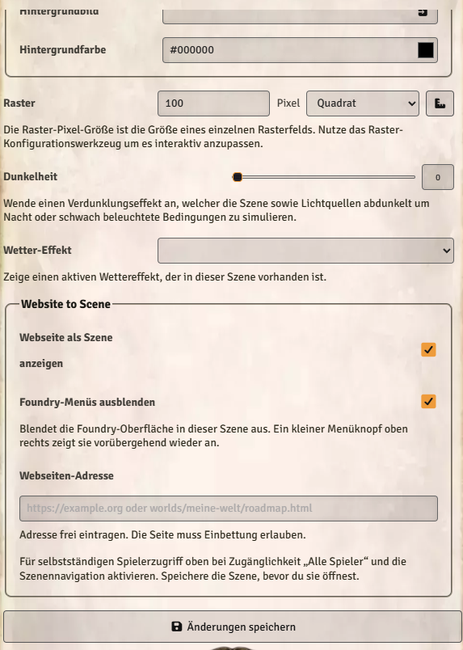

# Website to Scene

[Deutsch](#deutsch) · [English — jump to the English guide](#english)

**Version 1.1.0 (vorbereitet / unreleased) · Foundry VTT 14.369 · Autor / Author: Ginkgo85 · MIT**



## Deutsch

[Zur englischen Anleitung ↓](#english) · [Zurück nach oben ↑](#website-to-scene)

Interaktive Webseiten als randlose Vollbild-Szenen in Foundry VTT anzeigen. Die Webseiten-Adresse wird für jede Szene frei eingetragen. Foundrys Menüs können darüberliegen oder mit einem Haken ausgeblendet werden.

Das Modul ist öffentlich auf GitHub und im [offiziellen Foundry-Modulverzeichnis](https://foundryvtt.com/packages/website-to-scene) verfügbar. Die technische Modul-ID lautet `website-to-scene`; vorhandene Szeneneinstellungen bleiben erhalten.

### Sprache

Ab Version **1.1.0** erscheinen Beschriftungen, Erklärungen, URL-Fehlermeldungen und Menüknopf-Texte automatisch auf **Deutsch oder Englisch**, entsprechend der in Foundry eingestellten Sprache. Bei anderen Sprachen dienen die englischen Texte als Rückfall. Eine eigene Spracheinstellung im Modul ist nicht erforderlich. Nach einem Sprachwechsel Foundrys Aufforderung zum Neuladen folgen.

Die eingebettete Webseite bestimmt ihre Sprache selbst. Das README-Bild oben zeigt die deutsche Ansicht und bleibt unverändert.

**Veröffentlichungsstand:** Die Sprachunterstützung ist auf GitHub für 1.1.0 vorbereitet. Die derzeit veröffentlichte Version **1.0.2** verwendet weiterhin deutsche Modultexte; die folgenden Installationswege beziehen bis zum nächsten Release diese Version.

### Installation

1. Foundrys Setup öffnen → **Zusatzmodule → Modul installieren**.
2. Nach **Website to Scene** suchen und auf **Installieren** klicken.
3. Welt öffnen → **Module verwalten** → **Website to Scene** aktivieren.

**Alternative über Manifest-URL:** Im Fenster **Modul installieren** diese Adresse in **Manifest-URL** einfügen und installieren. Anschließend das Modul in der Welt aktivieren:

```text
https://github.com/Ginkgo85/Webside-to-Scene/releases/latest/download/module.json
```

Die Manifest-URL benötigt keine GitHub-Anmeldung. Neue Versionen lassen sich über Foundrys normale Modulaktualisierung beziehen; siehe [Foundrys Anleitung](https://foundryvtt.com/article/modules/).

**Manuelle Alternative:** Die ZIP-Datei `website-to-scene.zip` auf GitHub herunterladen und in `Data/modules/website-to-scene/` entpacken. `module.json` muss direkt in diesem Ordner liegen. Anschließend Foundry neu starten und das Modul in der Welt aktivieren. Vor einem Update eigene geänderte Moduldateien sichern.

### Webseite als Szene anzeigen

1. Szene bearbeiten → **Grundlagen → Website to Scene**.
2. **Webseite als Szene anzeigen** aktivieren.
3. Unter **Webseiten-Adresse** eine vollständige URL wie `https://example.org/roadmap` oder einen Pfad innerhalb von Foundrys Data-Ordner wie `worlds/meine-welt/roadmap.html` eintragen.
4. Szene speichern und öffnen. Die Webseite füllt den gesamten Browserbereich, ohne eigenes Fenster oder Kopfzeile.
5. Für die ganze Runde Foundrys normale **Szenenaktivierung** verwenden. Für selbstständigen Spielerzugriff zusätzlich **Zeige in Navigation** und die Zugänglichkeit **Alle Spieler** aktivieren.

Ein zusätzlicher „Alle hierher holen“-Knopf ist nicht erforderlich. Die Webseite muss für jeden Spieler erreichbar sein. Klicks, Scrollen und Anmeldung sind individuell; die Szenenaktivierung synchronisiert keine Aktionen innerhalb der Webseite.

### Foundry-Menüs ausblenden

Der Haken **Foundry-Menüs ausblenden** gilt pro Szene für alle Benutzer, die sie öffnen. Standardmäßig ist er ausgeschaltet. Er versteckt Szenennavigation, Werkzeuge, Spielerleiste, Chat, Makroleiste und die DSA-SC-/Kalenderleisten.

**Menüknopf oben rechts:** Damit kannst du die Foundry-Oberfläche vorübergehend für dich ein- oder ausblenden.

| Knopf | Funktion |
| :---: | --- |
| <h2>☰</h2> | **Menüs anzeigen** – Blendet die Foundry-Menüs vorübergehend nur für deinen eigenen Benutzer wieder ein. |
| <h2>×</h2> | **Menüs ausblenden** – Versteckt die Foundry-Menüs wieder, damit du die Webseite ungestört nutzen kannst. |

Beim Verlassen der Szene erscheint die normale Oberfläche automatisch wieder. Bereits geöffnete Fenster und Benachrichtigungen bleiben erreichbar.

### Hinweise und Grenzen

- Die Webseite muss Einbettung im iframe erlauben. `X-Frame-Options` oder CSP `frame-ancestors` können sie blockieren.
- Bei Foundry über HTTPS muss auch die Webseite HTTPS verwenden. `localhost` bezeichnet den Rechner des jeweiligen Spielers.
- Nur vertraute Webseiten eintragen. Interaktive Skripte sind erlaubt; das Modul injiziert keine Foundry-API. Bei eigenen HTML-Dateien auf derselben Domain ist die iframe-Sandbox keine vollständige Sicherheitsgrenze.
- Foundry-Werkzeuge bearbeiten keine Tokens oder Zeichnungen innerhalb der Webseite. Für Foundry-Tastenkürzel zuerst ein Foundry-Bedienelement anklicken.
- Foundrys vollständig abgeschalteter Canvas wird nicht unterstützt. Andere Oberflächenmodule können zusätzliche Elemente einblenden.
- Manueller Praxistest mit Foundry **14.369** durchgeführt und vom Nutzer bestätigt. Andere Versionen sowie Mehrspieler- und Proxy-/HTTPS-Konfigurationen sind nicht vollständig live geprüft.

### Support und Lizenz

Fehler mit Foundry-Version und nachvollziehbaren Schritten unter [Issues](https://github.com/Ginkgo85/Webside-to-Scene/issues) melden. Keine Zugangsdaten oder privaten Weltinhalte anhängen.

Autor: **Ginkgo85**. [MIT-Lizenz](LICENSE).

[Zur englischen Anleitung ↓](#english) · [Zurück nach oben ↑](#website-to-scene)

## English

[Zur deutschen Anleitung / German guide ↑](#deutsch) · [Back to top ↑](#website-to-scene)

Display interactive websites as borderless, full-screen scenes in Foundry VTT. Enter a website address for each scene and choose whether Foundry's menus remain visible or are hidden.

The module is publicly available on GitHub and in [Foundry's official module directory](https://foundryvtt.com/packages/website-to-scene). Its technical ID is `website-to-scene`; existing scene settings are preserved.

### Language

Starting with version **1.1.0**, labels, help text, URL validation messages and menu button text automatically appear in **German or English**, following the language selected in Foundry. Other languages fall back to English. No separate module language setting is needed. After changing the language, follow Foundry's prompt to reload.

The embedded website controls its own language. The README image above shows the German interface and remains unchanged.

**Release status:** Language support is prepared on GitHub for 1.1.0. The currently published version **1.0.2** still uses German module text; the installation methods below will install that version until the next release.

### Installation

1. Open Foundry's Setup → **Add-on Modules → Install Module**.
2. Search for **Website to Scene** and click **Install**.
3. Open your world → **Manage Modules** → enable **Website to Scene**.

**Alternative using the manifest URL:** In the **Install Module** window, paste this address into **Manifest URL** and install. Then enable the module in your world:

```text
https://github.com/Ginkgo85/Webside-to-Scene/releases/latest/download/module.json
```

No GitHub login is required. Use Foundry's regular module updater for future versions; see [Foundry's module guide](https://foundryvtt.com/article/modules/).

**Manual alternative:** Download the ZIP file `website-to-scene.zip` from GitHub and extract it into `Data/modules/website-to-scene/`. `module.json` must be directly inside that folder. Restart Foundry and enable the module in your world. Back up any personally modified module files before updating.

### Display a website as a scene

1. Edit a scene → **Basics → Website to Scene**.
2. Enable **Display website as a scene**.
3. Under **Website address**, enter a full URL such as `https://example.org/roadmap` or a path inside Foundry's Data folder such as `worlds/my-world/roadmap.html`.
4. Save and view the scene. The website fills the browser viewport without a separate window or title bar.
5. Use Foundry's normal **scene activation** to show it to the group. For independent player access, also enable **Show in Navigation** and accessibility for **All Players**.

No separate “Bring everyone here” button is needed. Each player must be able to access the website. Clicking, scrolling and signing in are individual; activating the scene does not synchronize actions within the website.

### Hide Foundry's menus

**Hide Foundry menus** applies to everyone viewing that scene and is off by default. It hides scene navigation, tools, the player list, chat, the macro bar and the DSA-SC/calendar bars.

**Menu button in the top-right corner:** Temporarily show or hide Foundry's interface for your own client.

| Button | Function |
| :---: | --- |
| <h2>☰</h2> | **Show menus** – Temporarily restores Foundry's menus for your own client only. |
| <h2>×</h2> | **Hide menus** – Hides Foundry's menus again so you can use the website without distractions. |

Leaving the scene automatically restores the normal interface. Already open windows and notifications remain accessible.

### Notes and limitations

- The website must allow iframe embedding. `X-Frame-Options` or CSP `frame-ancestors` can block it.
- If Foundry uses HTTPS, the website must also use HTTPS. `localhost` refers to each player's own computer.
- Only embed trusted websites. Interactive scripts are allowed; the module does not inject Foundry's API. For HTML hosted on Foundry's own domain, the iframe sandbox is not a complete security boundary.
- Foundry tools cannot edit tokens or drawings inside the website. Click a Foundry control before using Foundry keyboard shortcuts.
- Completely disabling Foundry's canvas is not supported. Other interface modules may show additional elements.
- Manual testing with Foundry **14.369** has been completed and confirmed by the user. Other versions, multiplayer and proxy/HTTPS configurations have not been fully tested live.

### Support and license

Report bugs in [Issues](https://github.com/Ginkgo85/Webside-to-Scene/issues), including your Foundry version and steps to reproduce. Do not attach credentials or private world content.

Author: **Ginkgo85**. [MIT license](LICENSE).

[Back to the German guide ↑](#deutsch) · [Back to top ↑](#website-to-scene)
